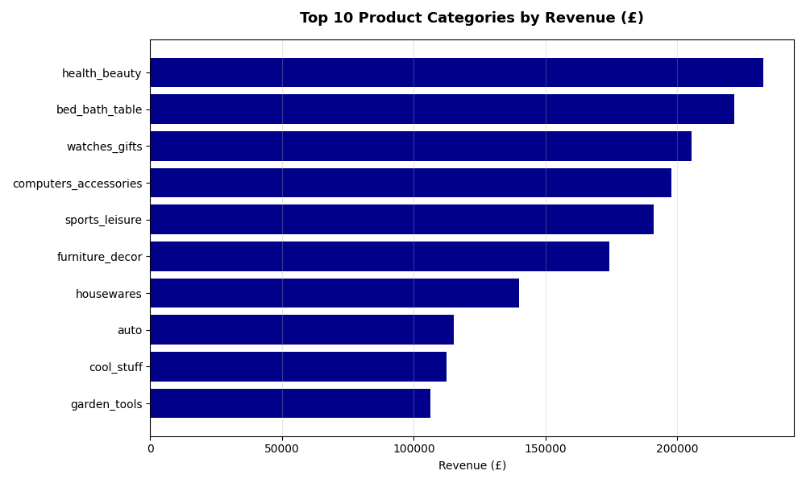

# Olist Supply Chain Analytics Hub 🚚

End-to-end supply chain analytics project using Olist's Brazilian e-commerce dataset. Will Cover vendor performance, delivery optimisation, customer impact analysis, churn prediction, NLP on customer reviews, and sales forecasting.

## 🛠️ Tech Stack
* **Language:** Python
* **Database Layer:** SQLite
* **Dashboard Interface:** Streamlit

## EDA

## ⚠️ Project Status: Under Construction

## 📚 Data Citation
Olist, and André Sionek. (2018). Brazilian E-Commerce Public Dataset by Olist [Dataset]. Kaggle. https://doi.org/10.34740/KAGGLE/DSV/195341
