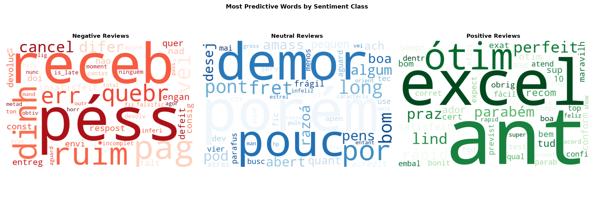

# 🛍️ Olist E-Commerce Analytics
### End-to-End Data Science Project | Marketing · Logistics · NLP

---

## 🛠️ Tech Stack

- **Language:** Python
- **Libraries:** Pandas, NumPy, Scikit-learn, NLTK, Transformers, Matplotlib, Seaborn, SciPy
- **Database:** SQLite
- **Models:** KMeans (clustering) · Logistic Regression (NLP) · XLM-RoBERTa (transformer comparison)
- **NLP Pipeline:** TF-IDF + RSLPStemmer + Portuguese stopwords

---

## 📊 Key Findings

- **Time Series:** Revenue peaks in November (Black Friday). Delivery improved from 50+ to under 10 days. Late rate spikes during high demand.

- **RFM:** 4 customer segments — Champions, At Risk, Promising, Lost. Optimal clusters at k=4.

- **Logistics:** Carrier transit (9 days) is the bottleneck — 3x longer than vendor handling (2.7 days). Freight cost shows no clear linear relationship with distance — suggesting flat-rate pricing. SLA breach varies by state (p < 0.001). Late delivery drives negative sentiment.

- **NLP:** TF-IDF model achieves 76% accuracy — beats XLM-RoBERTa (67%). Neutral reviews are the biggest challenge (F1: 0.29).

- **Sentiment Drivers:** Negative = delivery/payment complaints; Neutral = mixed language; Positive = speed/quality praise.

**Conclusion:** A lightweight, interpretable model delivers better performance than deep learning for this task — proving that domain-specific feature engineering adds more value than model complexity.

---

## 📊 Visualizations

### 📈 Time Series & Business Performance


*Revenue, orders, review scores, delivery days, and late rate trends over time.*

---

### 👥 Customer Segmentation


*Customer segments by recency, frequency, and monetary value.*


*Optimal cluster selection for KMeans.*

---

### 🚚 Logistics Insights


*Left: Carrier transit (9 days) is 3x longer than vendor handling (2.7 days). Right: Flat-rate freight pricing confirmed.*


*Logistics features correlated with review sentiment.*


*Regional delivery performance — SLA breach varies significantly by state (p < 0.001).*

---

### 💬 NLP & Sentiment Analysis


*Review length, score distribution, and key word frequencies by delivery status.*


*Most predictive words for negative (red), neutral (blue), and positive (green) sentiment.*


*Top 10 words driving each sentiment class.*

---

## 📥 Installation

**Prerequisites:** Python 3.10+

```bash
# Clone repository
git clone https://github.com/aguchhait-stack/olist-supply-chain-analytics.git
cd olist-supply-chain-analytics
 
# Install dependencies
pip install -r requirements.txt

# Windows (if required)
# pip install torch --index-url https://download.pytorch.org/whl/cpu
# pip install wordcloud --prefer-binary

# Launch notebook
jupyter notebook notebooks/01_olist_supply_chain_analysis.ipynb

# Run all tests
pytest tests/ -v
```
---

## 🚧 Current Development Status

The repository is currently being refactored from a research notebook into a production-grade Python package.

---

## 📚 Data Citation
Olist, and André Sionek. (2018). Brazilian E-Commerce Public Dataset by Olist [Dataset]. Kaggle. https://doi.org/10.34740/KAGGLE/DSV/195341
