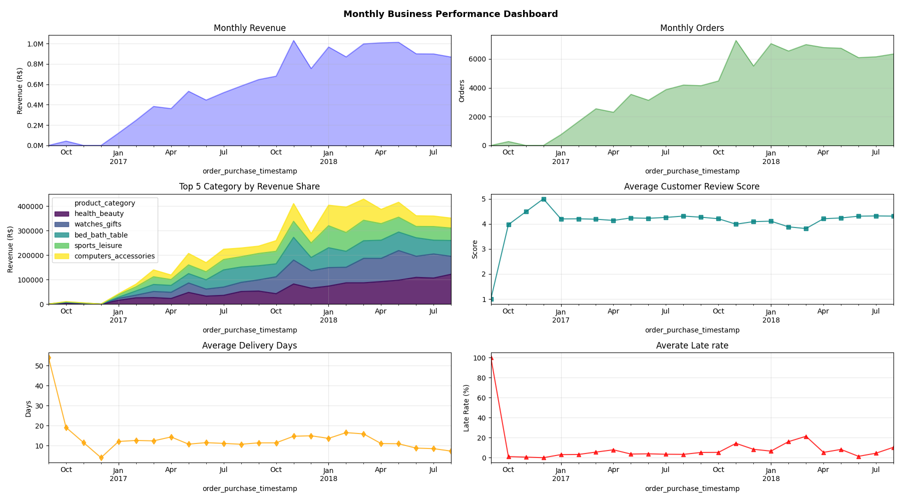
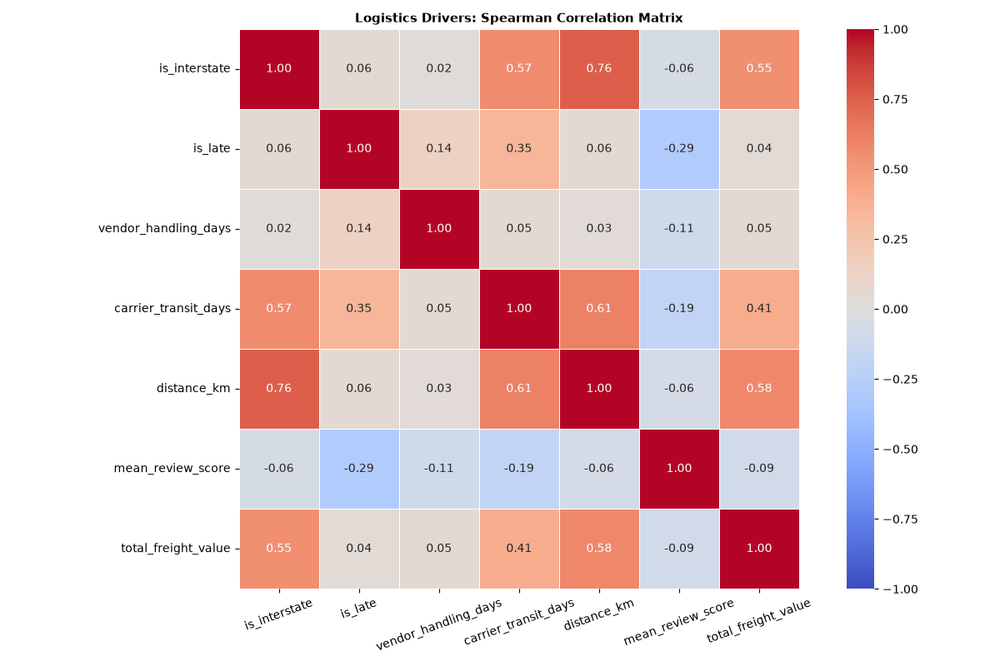
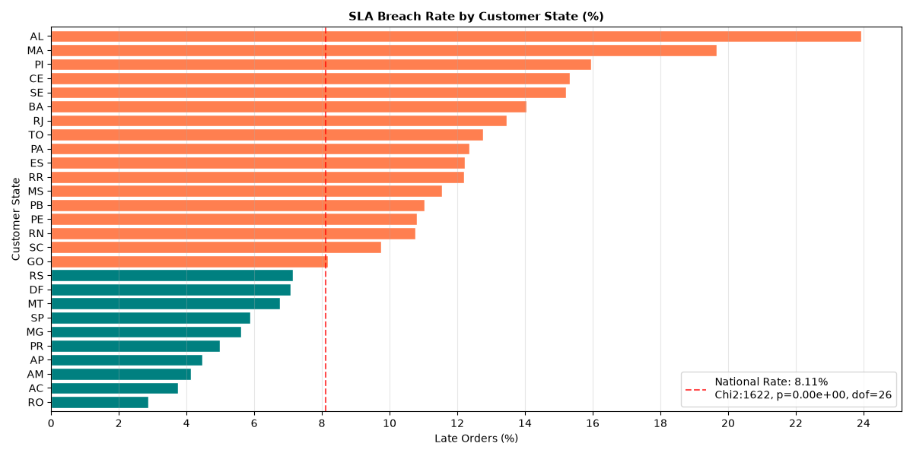
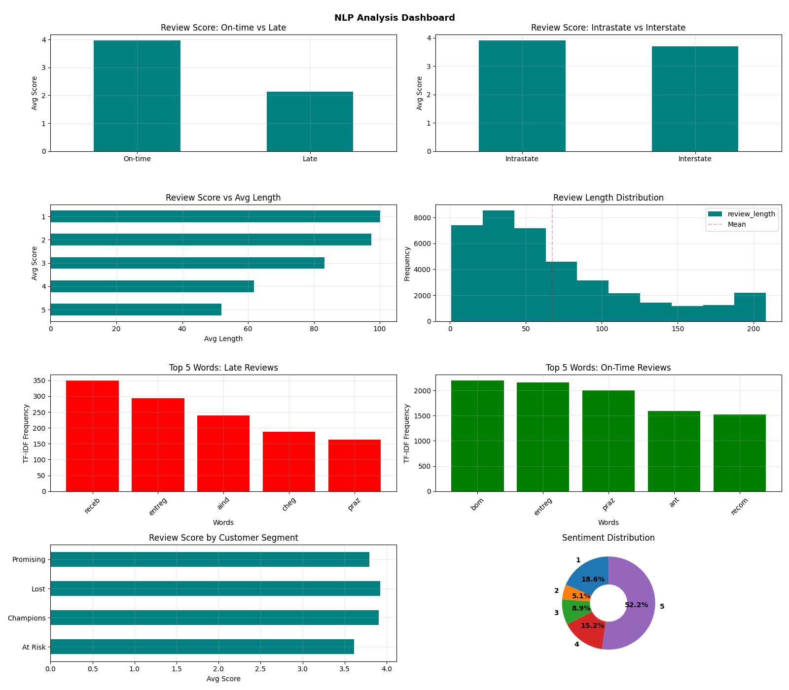
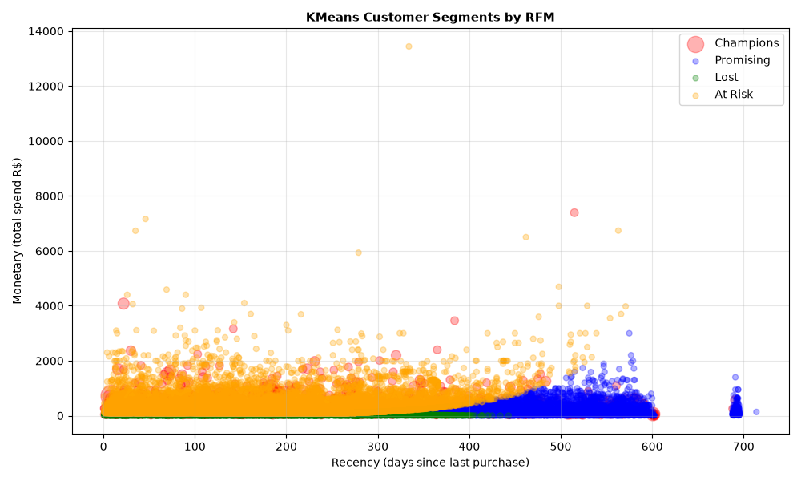

# 🚚 Olist Supply Chain Analytics Hub

End-to-end supply chain analytics project using Olist's Brazilian e-commerce dataset. Covers vendor performance, delivery optimisation, customer impact analysis, churn prediction, NLP on customer reviews, and sales forecasting.

---

## 🛠️ Tech Stack

- **Language:** Python
- **Database Layer:** SQLite

---
## 📊 EDA












---

## ⚠️ Project Status: Under Construction

---

## 📥 Installation

**Prerequisites:** Python 3.8+

```bash
git clone https://github.com/aguchhait-stack/olist-supply-chain-analytics.git
cd olist-supply-chain-analytics
pip install -r requirements.txt

# If WordCloud fails:
pip install --upgrade pip setuptools wheel
pip install wordcloud --use-pep517

#If PyTorch fails:
pip install torch --index-url https://download.pytorch.org/whl/cpu

# Run full pipeline 
jupyter notebook notebooks/notebook.ipynb
```
---

## 📚 Data Citation
Olist, and André Sionek. (2018). Brazilian E-Commerce Public Dataset by Olist [Dataset]. Kaggle. https://doi.org/10.34740/KAGGLE/DSV/195341
