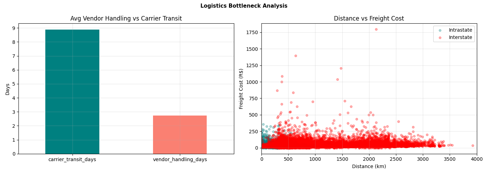
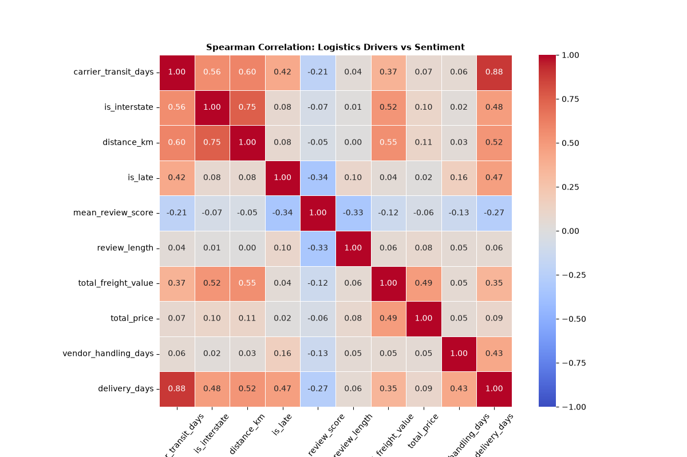
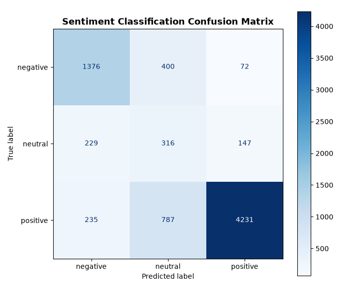
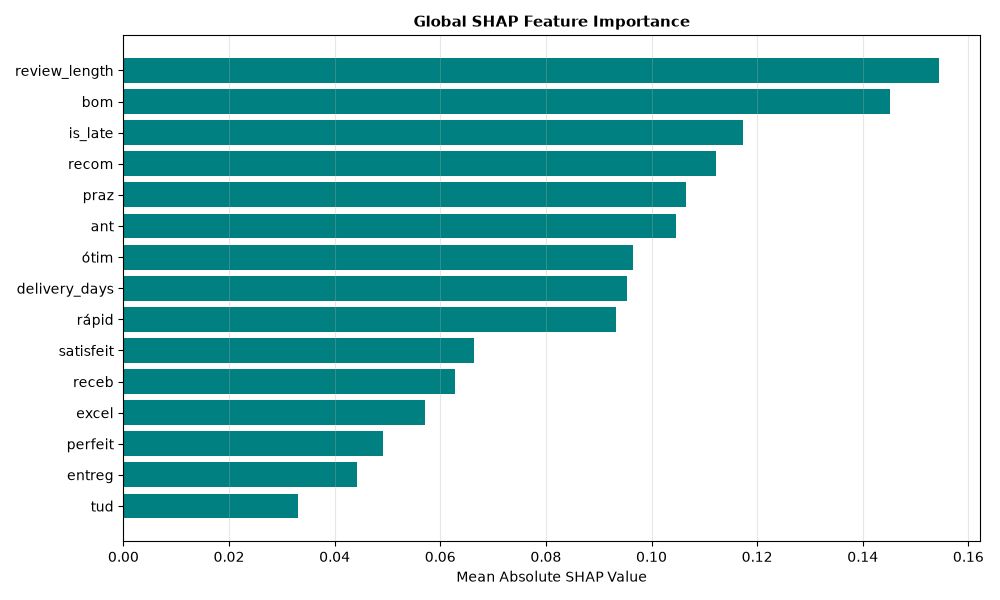
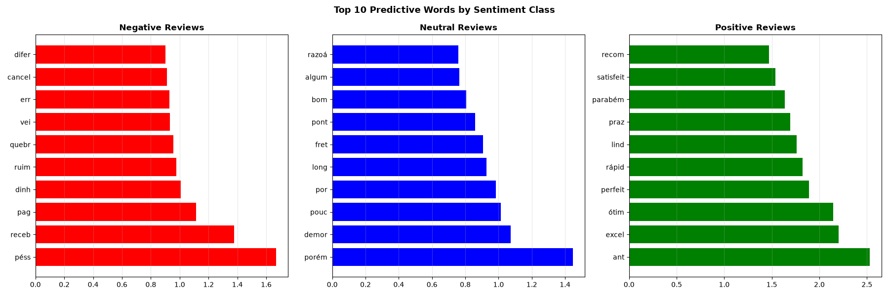
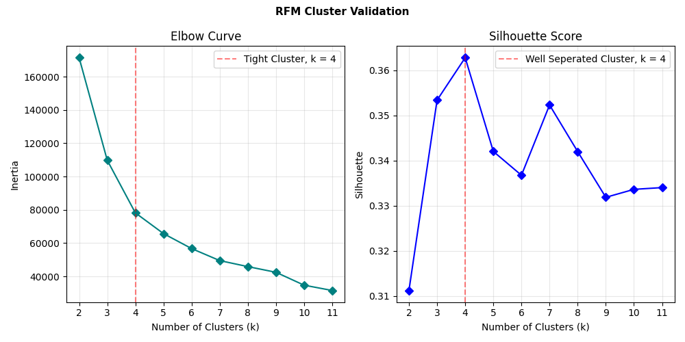

# 🛍️ Olist E-Commerce Analytics
### End-to-End Data Science Project | Business · Logistics · NLP · ML · RAG

An end-to-end data science project built on the Brazilian E-Commerce Public Dataset by Olist.

The project combines **business analytics, logistics analysis, customer segmentation, NLP sentiment classification, model explainability, and a RAG-powered AI assistant** into an interactive Streamlit application.

🔗 **[Live Demo →](https://olist-supply-chain-analytics.streamlit.app/)**

---

## 🚀 What This Project Does

- 📊 **Business Analytics** — revenue, orders, reviews and delivery performance
- 🚚 **Logistics Analytics** — SLA breaches, delivery bottlenecks and regional performance
- 💬 **Sentiment Analysis** — TF-IDF + Logistic Regression
- 👥 **Customer Segmentation** — RFM analysis with K-Means clustering
- 🔍 **Model Explainability** — SHAP feature importance and predictive words
- 🤖 **RAG Assistant** — ChromaDB retrieval with Gemini for business questions

---

## 🛠️ Tech Stack

- **Python:** Pandas, NumPy, SciPy
- **Data:** SQLite, SQLAlchemy
- **Machine Learning:** Scikit-learn, K-Means, Logistic Regression
- **NLP:** NLTK, TF-IDF, XLM-RoBERTa
- **Explainability:** SHAP
- **RAG:** Sentence-Transformers, ChromaDB, Google Gemini
- **Visualization:** Matplotlib, Seaborn, Streamlit
- **Engineering:** Git/GitHub, Pytest, Logging
- **Deployment:** Streamlit Cloud

---

## 📁 Project Structure

```text
olist-supply-chain-analytics/
│
├── app.py                 # Streamlit dashboard
├── main.py                # End-to-end analytics pipeline
├── notebook.ipynb         # Exploratory analysis and development
│
├── src/
│   ├── analysis/          # Business, logistics, NLP and RFM analysis
│   ├── data/              # Data ingestion and data preparation
│   ├── models/            # Sentiment modelling and baseline comparison
│   ├── rag/               # Knowledge base, embeddings, retrieval and Gemini assistant
│   ├── visualization/     # Business, logistics, NLP and RFM plots
│   └── utils/             # Validation and logging utilities
│
├── tests/                 # Automated tests
├── outputs/               # Generated visualizations
├── requirements.txt       # Python dependencies
├── pyproject.toml         # Package configuration
└── README.md
```
---

## 📊 Key Findings


### 🚚 Logistics

- **Carrier transit (~9 days) is the main operational bottleneck**, substantially longer than vendor handling (~2.7 days).
- **SLA breach rates vary significantly across Brazilian states** (**χ² = 1622.01, p < 0.001**).
- **Late deliveries are associated with lower customer review scores**, linking operational performance directly to customer experience.
- Average delivery time improved substantially over the dataset period, falling from **50+ days in 2016 to below 10 days in 2017**.

### 💬 NLP & Sentiment

The TF-IDF + Logistic Regression model achieved **76% overall accuracy**, with strong performance on positive and negative reviews but clear challenges with neutral sentiment.

#### Model Performance

| Sentiment | Recall | F1-Score | Support |
|-----------|--------|----------|---------|
| **Positive** | 81% | 0.87 | 5,253 |
| **Negative** | 74% | 0.75 | 1,848 |
| **Neutral** | 46% | 0.29 | 692 |

Neutral sentiment is the main modelling challenge, with an **F1-score of 0.29**, reflecting the difficulty of separating ambiguous language and the smaller number of neutral examples.

The TF-IDF model achieved a **66.6% match rate against the XLM-RoBERTa baseline**.

Sentiment analysis also shows that **late deliveries are associated with poorer customer reviews**, with negative reviews more strongly linked to delivery and payment-related language.

#### Model Explainability

SHAP analysis shows that sentiment predictions depend on both **review text and operational features**.

Features such as `review_length` and `delivery_days` can have high global SHAP importance even when they are not among the strongest class-specific predictive words.

This demonstrates the value of combining **textual and operational features** when modelling customer sentiment.

### 👥 Customer Segmentation

K-Means identified four customer groups:

**Champions · At Risk · Promising · Lost**

- **Champions** represent the highest-value customers and are strong candidates for loyalty strategies.
- **At Risk** customers provide an opportunity for targeted re-engagement.
- The segmentation combines **recency, frequency and monetary value** to distinguish customer behaviour.

### 📊 Business Performance

- **November is the strongest trading period**, with revenue and order volume peaking around Black Friday.
- **A small number of product categories drive a large share of revenue**, with computers and accessories among the leading categories.
- **Revenue and order volume show clear seasonal patterns**, providing useful insight for demand and capacity planning.

---

## 💡 Why This Matters

- **For Business:** Identify peak seasons, top product categories, and high-value customer segments.
- **For Operations:** Focus improvement efforts on the carrier stage and regional SLA performance.
- **For Customer Experience:** Reducing late deliveries could help improve customer satisfaction and sentiment.
- **For Data Science:** Combining text with operational features provides a more interpretable view of sentiment drivers.

---

## 📈 Visualizations

### 📊 Business Performance


*Revenue, order volume, review scores, delivery time and late-delivery trends over time.*

---

### 🚚 Logistics


*Regional SLA breach performance across Brazilian states.*



*Delivery distance, freight cost and operational bottlenecks.*



*Relationships between logistics variables and customer sentiment.*

---

### 💬 NLP & Sentiment Analysis


*Review characteristics and sentiment-related patterns across delivery groups.*



*Classification performance across negative, neutral and positive reviews.*



*Top 15 features by global mean absolute SHAP value.*



*Top predictive words for each sentiment class.*

---

### 👥 Customer Segmentation


*Customer segments based on recency, frequency and monetary value.*



*K-Means validation supporting the selection of four customer segments.*

---

## 🤖 RAG Business Assistant

The project includes a RAG-based business assistant that connects the analytical outputs to a natural-language interface.

**Knowledge Base → Embeddings → ChromaDB → Retrieval → Gemini**

The knowledge base contains insights from:

- Business KPIs
- Logistics and SLA analysis
- Customer segmentation
- Sentiment analysis
- SHAP feature importance

Example questions:

- Which state has the highest SLA breach rate?
- Which product categories generate the most revenue?
- What are the most important features influencing sentiment predictions?
- What does the sentiment analysis tell us about late deliveries?
- Which customer segment has the highest value, and how should it be targeted?

The assistant uses retrieved project knowledge as context rather than relying on unrestricted responses.

---

## 📥 Installation

**Prerequisites:** Python 3.10+

```bash
# Clone repository
git clone https://github.com/aguchhait-stack/olist-supply-chain-analytics.git
cd olist-supply-chain-analytics

# Create virtual environment
python3 -m venv .venv
source .venv/bin/activate   # Windows: .venv\Scripts\activate

# Install dependencies
pip install -r requirements.txt

# Install project in editable mode
pip install -e .

# Register Jupyter kernel
python -m ipykernel install --user --name=olist-venv --display-name "Python (olist-venv)"

# Launch notebook
jupyter notebook notebook.ipynb

# Launch Streamlit dashboard
streamlit run app.py

# Run complete pipeline
python main.py

# Run tests
pytest tests/ -v
```
---

## 📚 Data Citation

Olist, & Sionek, A. (2018).  
*Brazilian E-Commerce Public Dataset by Olist* [Dataset]. Kaggle.

https://doi.org/10.34740/KAGGLE/DSV/195341