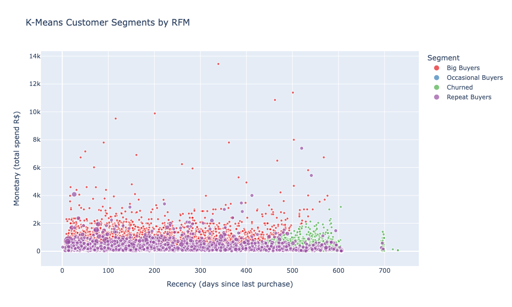

# 🚚 Olist Supply Chain Analytics Hub

End-to-end supply chain analytics project using Olist's Brazilian e-commerce dataset. Covers vendor performance, delivery optimisation, customer impact analysis, churn prediction, NLP on customer reviews, and sales forecasting.

---

## 🛠️ Tech Stack

- **Language:** Python
- **Database Layer:** SQLite
- **Dashboard Interface:** Streamlit

---

## Data Architecture — Medallion Pattern
- **Bronze:** Raw SQLite tables (9 tables, ingested via SQLAlchemy)
- **Silver:** `master_df` — 8-table join, item-level grain, 
  source of truth for all downstream analysis
- **Gold:** Subject-area DataFrames derived from master_df
  - `sales_df` — item-level, price nulls removed
  - `logistics_df` — order-level, delivered orders only  

---

## 📊 EDA




---

## ⚠️ Project Status: Under Construction

---

## 📥 Installation

**Prerequisites:** Python 3.8+

```bash
# Clone repository
git clone https://github.com/aguchhait-stack/olist-supply-chain-analytics.git
cd olist-supply-chain-analytics

# Install dependencies
pip install -r requirements.txt

# Run full pipeline (python3 for macOS/Linux, python for Windows)
jupyter notebook notebook.ipynb
```

---

## 📚 Data Citation
Olist, and André Sionek. (2018). Brazilian E-Commerce Public Dataset by Olist [Dataset]. Kaggle. https://doi.org/10.34740/KAGGLE/DSV/195341
